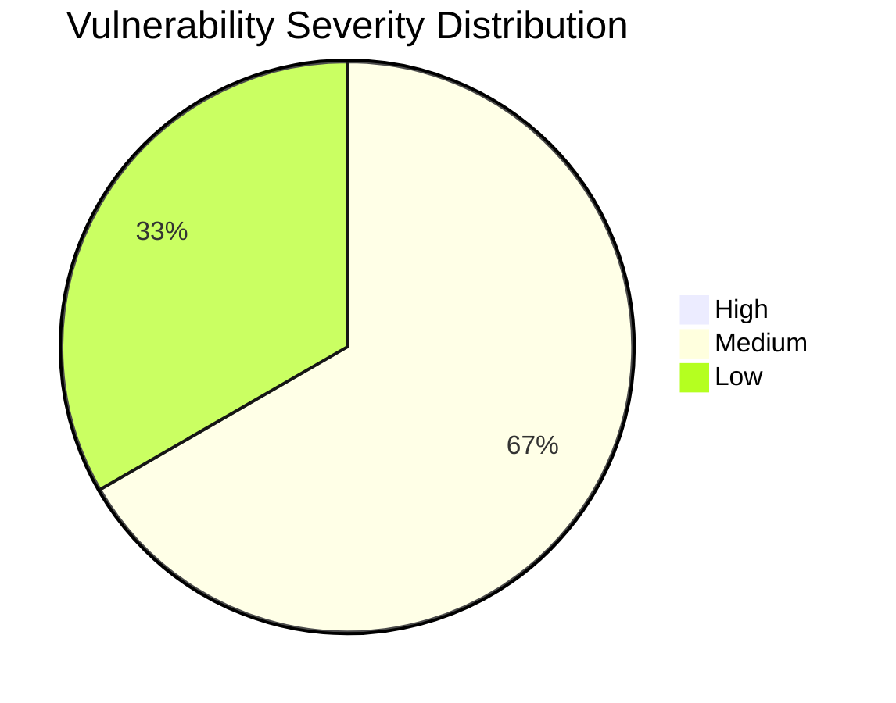

```markdown
# Cybersecurity Vulnerability Assessment Report: scanme.nmap.org

**Date:** October 26, 2023

**Prepared By:** Report Writer

## 1. Introduction

This report details the findings of a cybersecurity vulnerability assessment conducted on scanme.nmap.org. The primary goal of this assessment was to identify potential security weaknesses that could be exploited by malicious actors to compromise the system. This report provides a comprehensive overview of detected vulnerabilities, their potential impacts, and actionable mitigation strategies. It is designed to be accessible to both technical and non-technical audiences, facilitating informed decision-making regarding security improvements. The assessment leveraged Nmap scanning tools and focused on identifying open ports and the services running on them, followed by an analysis of potential vulnerabilities associated with these services.

## 2. Executive Summary

The vulnerability assessment of scanme.nmap.org revealed several potential security concerns. Three open ports were identified: 22 (SSH), 80 (HTTP), and 31337 (tcpwrapped). An outdated SSH version (OpenSSH 7.6p1 Ubuntu 4ubuntu0.7) on port 22 poses a medium-severity risk due to known exploits. The HTTP service (Apache httpd 2.4.29 ((Ubuntu))) on port 80 presents a low-severity risk due to information disclosure. The service on port 31337 (tcpwrapped) requires further investigation to determine its purpose and associated vulnerabilities. Overall, addressing the outdated SSH version is a priority, along with investigating the service on port 31337. Implementing the recommended mitigation strategies will significantly improve the security posture of scanme.nmap.org. The predictable IP ID sequence and clock skew are noted but present lower immediate risks.

## 3. Detailed Findings

### 3.1. Summary Table of Vulnerabilities

| Vulnerability Name                 | Affected System | Severity Level | CVSS Score | Status |
| :--------------------------------- | :-------------- | :------------- | :--------- | :----- |
| Outdated SSH Version               | scanme.nmap.org | Medium         | N/A        | Open   |
| Apache Version Exposure            | scanme.nmap.org | Low            | N/A        | Open   |
| Unidentified tcpwrapped Service | scanme.nmap.org | Medium         | N/A        | Open   |

### 3.2. Port 22: SSH (OpenSSH 7.6p1 Ubuntu 4ubuntu0.7)

*   **Vulnerability:** Outdated SSH version. OpenSSH 7.6p1 is susceptible to various known exploits. While OS hardening or configuration might mitigate some specific exploits, the use of older software generally increases the attack surface.
*   **Severity:** Medium
*   **Potential Impact:** Unauthorized access to the system, data breach, or complete system compromise. Attackers could exploit known vulnerabilities to gain control of the server.
*   **Mitigation:**
    *   Upgrade OpenSSH to the latest stable version to patch known vulnerabilities.
    *   Enforce strong password policies and consider implementing multi-factor authentication (MFA).
    *   Disable password authentication and use SSH keys for enhanced security.
    *   Implement robust monitoring of SSH logs for suspicious activities and unauthorized access attempts.

### 3.3. Port 80: HTTP (Apache httpd 2.4.29 ((Ubuntu)))

*   **Vulnerability:** Apache version disclosure. Revealing the specific Apache version allows attackers to research and target version-specific vulnerabilities. The HTTP server header also discloses the Ubuntu OS.
*   **Severity:** Low
*   **Potential Impact:** Information disclosure, potentially leading to targeted attacks. Gaining knowledge about the server's configuration allows attackers to tailor their attacks more effectively.
*   **Mitigation:**
    *   Update Apache to the latest stable version to address known vulnerabilities.
    *   Hide the server version in the HTTP header to reduce information disclosure. This can be configured in the Apache configuration file.
    *   Implement a web application firewall (WAF) to protect against common web attacks.
    *   Regularly scan the web application for vulnerabilities using tools like OWASP ZAP or Nessus.

### 3.4. Port 31337: tcpwrapped

*   **Vulnerability:** The service running on this port is 'tcpwrapped,' indicating a custom or less common service. The specific risks are unclear without further investigation, but unusual ports can host backdoors or other malicious services.
*   **Severity:** Medium
*   **Potential Impact:** Unknown. Requires further investigation to determine the service's purpose and any associated vulnerabilities. It could range from a benign service to a critical backdoor.
*   **Mitigation:**
    *   Identify the service running on port 31337 using tools like `netstat`, `lsof`, or `nmap -sV`.
    *   Assess the security of the service, including reviewing its code and configuration.
    *   Implement strict access controls and continuous monitoring.
    *   If the service is not required or its purpose cannot be determined, disable it immediately.

### 3.5. General Observations

*   **IP ID Sequence Prediction:** The `ipidseq` script result "Incremental!" suggests that the IP ID sequence is predictable, potentially exploitable for man-in-the-middle attacks. While less relevant in modern networks, it should be considered in specific contexts.
*   **Clock Skew:** The `clock-skew` script indicates a minor clock skew. Although not a direct vulnerability, significant clock skew can cause issues with authentication and other security mechanisms. Regularly synchronize the system clock using NTP.

## 4. Visual Representations

### 4.1. Vulnerability Severity Distribution



This pie chart illustrates the distribution of vulnerability severity levels identified during the assessment. As shown, the majority of identified vulnerabilities are classified as Medium severity.

## 5. Comparative Analysis Against Industry Benchmarks

| Vulnerability                      | Industry Benchmark (OWASP Top 10) | Status        | Recommendation                                                 |
| :--------------------------------- | :----------------------------------- | :------------ | :------------------------------------------------------------- |
| Outdated SSH Version               | N/A                                  | Non-Compliant | Upgrade to the latest stable version.                          |
| Apache Version Exposure            | A5:2017 Security Misconfiguration      | Non-Compliant | Hide server version in HTTP header.                            |
| Unidentified tcpwrapped Service | A6:2017 Vulnerable and Outdated Components     | Non-Compliant | Identify, assess, and secure or disable the service.         |

This table compares the identified vulnerabilities against the OWASP Top 10, highlighting deviations from industry best practices.

## 6. Mitigation Strategies

| Recommended Mitigation Step                        | Priority | Estimated Effort | Responsible Party |
| :------------------------------------------------- | :------- | :--------------- | :---------------- |
| Upgrade OpenSSH to the Latest Stable Version       | High     | Medium           | System Admin      |
| Hide Apache Server Version in HTTP Header          | Medium   | Short            | System Admin      |
| Identify and Assess tcpwrapped Service            | High     | Medium           | Security Team     |
| Implement Strong Password Policies/MFA for SSH     | Medium   | Medium           | System Admin      |
| Monitor SSH Logs for Suspicious Activity           | Medium   | Short            | Security Team     |
| Regularly Scan Web Application for Vulnerabilities | Medium   | Medium           | Security Team     |

This table provides actionable recommendations for mitigating the identified vulnerabilities, along with their priority, estimated effort, and responsible party.

## 7. Threat Impact Assessment

| Threat Description                    | Potential Impact                      | Likelihood | Risk Level                         |
| :------------------------------------ | :------------------------------------ | :--------- | :--------------------------------- |
| Exploitation of Outdated SSH Version   | Unauthorized System Access, Data Breach | Medium     | <span style="color:red">High</span>   |
| Information Disclosure via Apache Version | Targeted Attacks                      | Low        | <span style="color:yellow">Medium</span> |
| Malicious Activity via tcpwrapped      | System Compromise, Backdoor           | Low        | <span style="color:yellow">Medium</span> |

**Risk Level Color Coding:**

*   <span style="color:red">High</span>: Critical risk requiring immediate attention.
*   <span style="color:yellow">Medium</span>: Moderate risk requiring timely action.
*   <span style="color:green">Low</span>: Minor risk requiring monitoring.

This section outlines the risks associated with each threat, using color-coded risk levels to enhance clarity.

## 8. Conclusion

The vulnerability assessment of scanme.nmap.org revealed several potential security vulnerabilities. Addressing the outdated SSH version and investigating the service running on port 31337 are the top priorities. Implementing the recommended mitigation strategies will significantly improve the security posture of the system. Regular security audits, patch management, and intrusion detection and prevention systems are crucial for maintaining a strong security posture. Furthermore, ongoing monitoring and analysis of system logs are essential for detecting and responding to potential threats in a timely manner. By taking these steps, the organization can effectively reduce its attack surface and minimize the risk of security breaches.
```